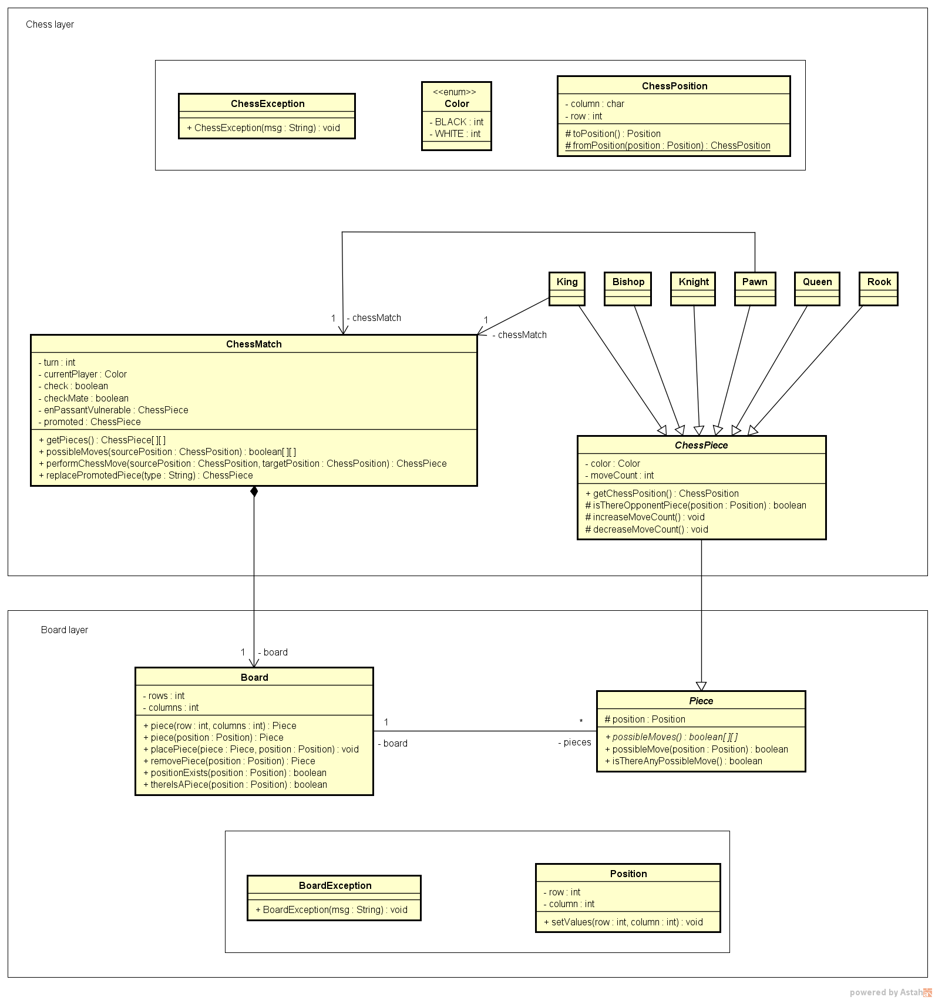

# ♟️ Chess System - Jogo de Xadrez em Java

Sistema de jogo de xadrez desenvolvido em **Java puro**, executado via terminal. O projeto aplica de forma prática os principais conceitos de **Programação Orientada a Objetos**, com uma arquitetura em camadas bem definida e implementação completa das regras do xadrez.

Projeto desenvolvido durante o curso **Programação Orientada a Objetos com Java** do Prof. Nélio Alves — DevSuperior.

## 🖼️ Design do Sistema (UML)



## ✨ Funcionalidades

- Tabuleiro 8x8 renderizado no terminal com cores
- Movimentação de todas as peças: Rei, Rainha, Torre, Bispo, Cavalo e Peão
- Exibição dos movimentos possíveis de cada peça
- Controle de turno e troca de jogador
- Detecção de **Xeque** e **Xeque-Mate**
- Listagem de peças capturadas
- Movimentos especiais:
  - **Roque** (Castling)
  - **En Passant**
  - **Promoção de Peão**

## 🧠 Conceitos de POO Aplicados

- Encapsulamento
- Herança
- Polimorfismo
- Classes e métodos abstratos
- Exceções customizadas (`ChessException`, `BoardException`)
- Enumerações (`Color`)
- Padrão de camadas (Board Layer / Chess Layer)
- Estruturas de dados: Matrizes e Listas

## 🏗️ Arquitetura do Projeto

O sistema é dividido em duas camadas principais:

```text
chess-system-java/
├── src/
│   ├── application/
│   │   └── Program.java        # Ponto de entrada
│   ├── boardgame/
│   │   ├── Board.java
│   │   ├── BoardException.java
│   │   ├── Piece.java
│   │   └── Position.java
│   └── chess/
│       ├── ChessException.java
│       ├── ChessMatch.java
│       ├── ChessPiece.java
│       ├── ChessPosition.java
│       ├── Color.java
│       └── pieces/
│           ├── Bishop.java
│           ├── King.java
│           ├── Knight.java
│           ├── Pawn.java
│           ├── Queen.java
│           └── Rook.java
```

## 🛠️ Tecnologias Utilizadas

- **Java** (sem frameworks externos)
- **Git** e **GitHub**
- Terminal **Git Bash** (necessário para exibição de cores no Windows)

## 🚀 Como Executar o Projeto

### Pré-requisitos

- Java JDK instalado
- Git Bash instalado (Windows) — necessário para exibir as cores corretamente no terminal

### 1. Clonar o repositório

```bash
git clone https://github.com/MiltonRafaeel/NOME_DO_SEU_REPOSITORIO.git
```

### 2. Acessar a pasta `bin`

```bash
cd NOME_DO_SEU_REPOSITORIO/bin
```

### 3. Executar o programa

```bash
java application/Program
```

> ⚠️ **Importante:** Execute sempre pelo **Git Bash** para que as cores do tabuleiro sejam exibidas corretamente. No terminal padrão do Windows (CMD/PowerShell), as cores podem não funcionar.

## 🎮 Como Jogar

1. O jogo exibe o tabuleiro e indica de quem é o turno
2. Digite a **posição de origem** da peça (ex: `e2`)
3. Os movimentos possíveis serão destacados no tabuleiro
4. Digite a **posição de destino** (ex: `e4`)
5. O turno passa para o próximo jogador
6. O jogo detecta automaticamente **Xeque** e **Xeque-Mate**

## 📚 Aprendizados

Este projeto consolidou na prática:

- Modelagem de sistemas com UML e diagramas de classes
- Arquitetura em camadas com separação de responsabilidades
- Implementação de regras de negócio complexas em Java puro
- Tratamento robusto de exceções
- Uso de estruturas de dados (matrizes e listas)
- Versionamento com Git desde o início do projeto
